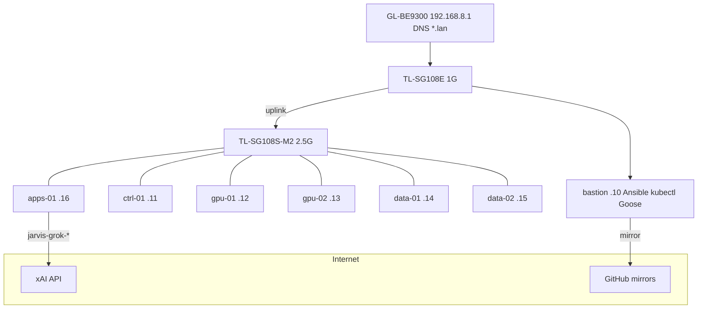
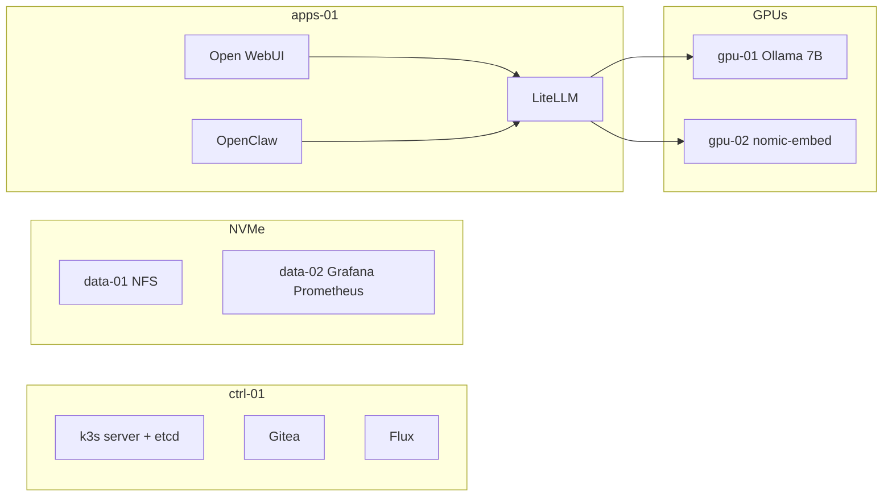

# JARVIS infra

**Metal, OS, and bootstrap** for a six-node home AI cluster. Running Kubernetes
apps are **not** here — they live in Gitea and are mirrored to
[gordoncooper/jarvis-cluster](https://github.com/gordoncooper/jarvis-cluster).

| Repo | Role | Authoritative? |
|---|---|---|
| **this repo** | Ansible, disks, NVIDIA, k3s join, secrets, backups, rebuild docs | Yes — GitHub |
| `http://git.lan/jarvis/cluster.git` | Flux GitOps (Deployments, Ingress, skills) | **Yes — Gitea on the LAN** |
| `gordoncooper/jarvis-cluster` | Nightly `git push --mirror` of Gitea | No — disaster copy only |

- From-scratch rebuild: [docs/REBUILD.md](docs/REBUILD.md)
- Mistakes we will not repeat: [docs/LESSONS.md](docs/LESSONS.md)
- Day-to-day: [docs/INTERACT.md](docs/INTERACT.md) · smoke: [docs/SMOKE-OPERATOR.md](docs/SMOKE-OPERATOR.md)
- PHASE1–20: [docs/history/](docs/history/)

## What this cluster is for

LAN-only home JARVIS: talk to it in a browser, have it **use the lab**
(kubectl, Prometheus, git), keep Grok for tools and a local 7B for private/cheap
chat. No public ports. SuperGrok chat quota is **not** the xAI API —
`jarvis-grok-code` bills [console.x.ai](https://console.x.ai).

| You want | Where |
|---|---|
| Chat / voice / RAG | `https://chat.lan` — `jarvis-local` ($0 GPU) or Grok (API $) |
| Agent with cluster hands | `http://agent.lan:18789` (OpenClaw, not port 80) |
| Terminal agent | bastion `goose session` · model `jarvis-grok-code` |
| Change the cluster | push to Gitea → Flux |
| Survive power loss | etcd snapshots + NFS tarballs, nightly |

## Hardware and LAN

Six Lenovo ThinkCentre **M920x** (i7-8700T, 32 GiB, Ubuntu 26.04) + bastion.
Two RTX A1000 8 GB. Four 512 GB Patriot P300 for `/cluster`. 1500 VA UPS.
Never internet-exposed.

| Host | IP | Extra DNS |
|---|---|---|
| router | 192.168.8.1 | |
| bastion | 192.168.8.10 | |
| ctrl-01 | 192.168.8.11 | git.lan jarvis.lan grafana.lan llm.lan chat.lan home.lan |
| gpu-01 | 192.168.8.12 | |
| gpu-02 | 192.168.8.13 | |
| data-01 | 192.168.8.14 | |
| data-02 | 192.168.8.15 | |
| apps-01 | 192.168.8.16 | **agent.lan** (hostPort 18789) |

DHCP pool is `.100–.249`. Nodes are static. Router click-ops: [bootstrap/router.md](bootstrap/router.md).

## Node roles

| Node | Labels | Runs |
|---|---|---|
| bastion | — | Ansible, kubectl, Goose, mkcert, SOPS, backup timer |
| ctrl-01 | `jarvis.role=control` | k3s server, etcd, Gitea, Flux |
| gpu-01 | `jarvis.role=gpu` `jarvis.gpu=chat` | Ollama chat (qwen2.5 7B q6_K) |
| gpu-02 | `jarvis.role=gpu` `jarvis.gpu=perception` | Ollama embed |
| data-01 | `jarvis.role=storage` `jarvis.storage=primary` | NFS, snapshots, backups |
| data-02 | `jarvis.role=storage` `jarvis.storage=replica` | Grafana + Prometheus |
| apps-01 | `jarvis.role=apps` | Open WebUI, LiteLLM, Piper, OpenClaw, Homepage |

P300 is matched by **model string**, never `nvme0` vs `nvme1`.

## What this repo owns

    inventory/   playbooks/   roles/   k3s/   scripts/   secrets/   systemd/   docs/

Not here: Open WebUI / OpenClaw YAML — that is GitOps in Gitea.

## Day-two ops (bastion as `agent`)

    cd ~/jarvis-infra
    ansible-playbook playbooks/ping.yml
    ansible-playbook playbooks/slim.yml
    ./scripts/smoke-operator.sh
    ./scripts/cluster-update-reboot.sh
    ssh ctrl-01 'sudo k3s etcd-snapshot save --config /etc/rancher/k3s/snapshot.yaml'

Kernels are **not pinned**. Unattended-upgrades is **off**. NVIDIA modules are
installed for the **HWE kernel that will boot**, not old ABIs in `/boot`.

Secrets: SOPS+age on the bastion only. Flux never reads GitHub.

Current tag: **v0.4.3**.
