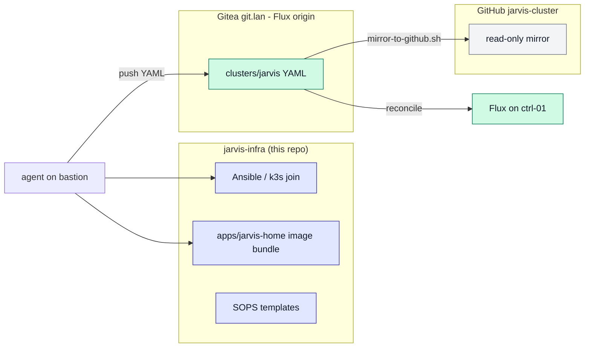
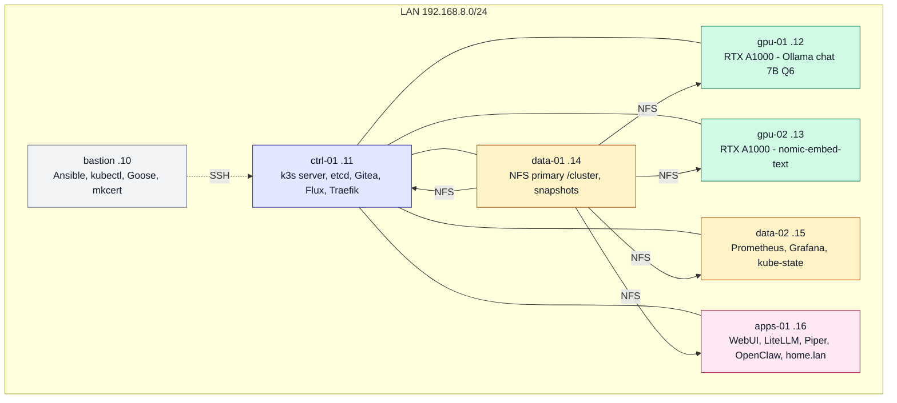
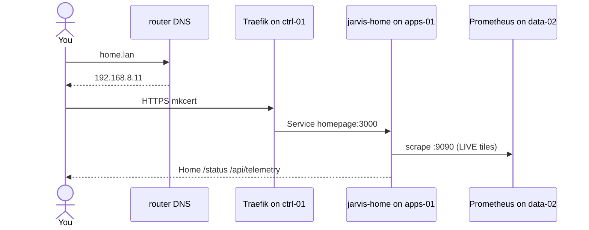

# jarvis-infra

Metal, bootstrap, and the **command-center image** for JARVIS — a six-node
k3s homelab on ThinkCentre M920x, plus a bastion jump host.

This repo is **not** the Flux origin. Cluster YAML lives on Gitea
(`http://git.lan/jarvis/cluster.git`). GitHub
[gordoncooper/jarvis-cluster](https://github.com/gordoncooper/jarvis-cluster)
is a **mirror only**.

| Item | Value |
| --- | --- |
| Known-good git tag | **v0.4.9** (these READMEs). Do not retag v0.4.4–v0.4.8. |
| Homepage image | **jarvis-home:v0.4.8** (`imagePullPolicy: Never` on apps-01) |
| Run as | user **agent** (`HOME=/home/agent`). Never `bastion`. |
| Rebuild | [docs/REBUILD.md](docs/REBUILD.md) |
| Lessons | [docs/LESSONS.md](docs/LESSONS.md) |
| Day to day | [docs/INTERACT.md](docs/INTERACT.md) |
| Command center | [apps/jarvis-home/](apps/jarvis-home/) (`output/` is committed) |

## Why two repos

Infra owns **metal + the image**. Gitea owns **YAML**. GitHub cluster is a
read-only mirror so a house fire still has history.



Chicken-egg: Flux needs Gitea; Gitea is a cluster app. Infra bootstraps Gitea
**once**, then Gitea owns YAML forever. Never point Flux at GitHub.

## Rack and roles

Six M920x (i7-8700T, 32 GiB) run k3s `v1.36.4+k3s1`. Bastion is jump only —
**not** a k3s node, no node-exporter, no GPU.



| Host | IP | Role | Runs |
| --- | --- | --- | --- |
| bastion | 192.168.8.10 | jump | Ansible, kubectl, Goose. Not scheduled. |
| ctrl-01 | 192.168.8.11 | control + etcd | k3s server, Gitea, Flux, Traefik. Ingress VIP for LAN names. |
| gpu-01 | 192.168.8.12 | gpu-chat | Ollama jarvis-local (qwen2.5 7B Q6). |
| gpu-02 | 192.168.8.13 | gpu-embed | Ollama nomic-embed-text. |
| data-01 | 192.168.8.14 | storage-primary | NFS export /cluster. etcd snapshots, backups. |
| data-02 | 192.168.8.15 | metrics | Prometheus, Grafana, kube-state-metrics. |
| apps-01 | 192.168.8.16 | apps | Open WebUI, LiteLLM, Piper, OpenClaw, jarvis-home. |

Labels: jarvis.role=control|gpu|storage|apps. Homepage: imagePullPolicy Never on apps-01 only.

## How a browser request lands



agent.lan is the exception: DNS must be 192.168.8.16 (hostPort 18789), not ctrl-01.

## Surfaces

| URL | What |
| --- | --- |
| https://home.lan | Command center (Home + /status + 10-min event stream). Header LIVE = Prometheus. |
| https://chat.lan | Open WebUI (Whisper STT, Piper TTS) |
| http://agent.lan:18789 | OpenClaw. DNS must be .16. HTTP on purpose. |
| https://llm.lan/v1 | LiteLLM (jarvis-local, jarvis-grok, jarvis-grok-code) |
| http://git.lan | Gitea (HTTP on purpose — Flux origin) |
| https://grafana.lan | Grafana (NVIDIA dashboard 14574) |

LAN only. mkcert TLS. Never internet-exposed.

## What this repo contains

- inventory / playbooks / roles — OS, UFW, NFS, NVIDIA, P300 as /cluster
- k3s/ — server install (etcd on ctrl-01) and agent join
- bootstrap/gitea.yaml — first Gitea apply (before Flux exists)
- apps/jarvis-home/ — Dockerfile + committed output/ SSR bundle
- scripts/install-jarvis-home.sh — docker build on apps-01, k3s ctr import
- scripts/mirror-to-github.sh — Gitea to GitHub cluster mirror
- docs/ — rebuild, restore, lessons, history (PHASE1-22)

Greenfield does **not** run npm run build on the cluster. Image:
docker.io/library/jarvis-home:v0.4.8

```
ansible-playbook playbooks/ping.yml
ansible-playbook playbooks/site.yml
./k3s/install-server.sh
./k3s/join-agents.sh
./scripts/install-jarvis-home.sh
```

Full order: [docs/REBUILD.md](docs/REBUILD.md).
