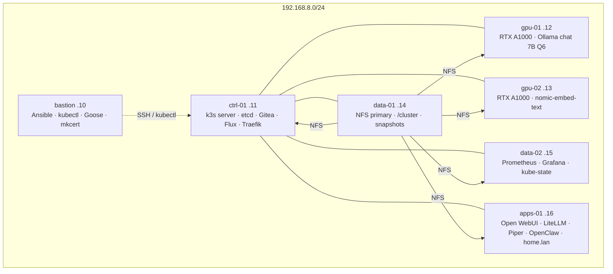

# jarvis-infra

Metal, bootstrap, and the **command-center image** for JARVIS — a six-node
k3s homelab on ThinkCentre M920x, plus a bastion.

This repo is **not** the Flux origin. Cluster YAML lives on Gitea
(`http://git.lan/jarvis/cluster.git`). GitHub
[`gordoncooper/jarvis-cluster`](https://github.com/gordoncooper/jarvis-cluster)
is a **mirror only**.

| Item | Value |
| --- | --- |
| Known-good git tag | **v0.4.6** (this README). Image **jarvis-home:v0.4.5**. Do not retag v0.4.4 / v0.4.5. |
| Run as | user **`agent`** (HOME `/home/agent`). Never `bastion`. |
| Rebuild | [docs/REBUILD.md](hocs/REBUILD.md) |
| Do not repeat | [docs/LESSONS.md](docs/LESSONS.md) |
| Day to day | [docs/INTERACT.md](docs/INTERACT.md) |
| Command center | [apps/jarvis-home/](apps/jarvis-home/) (`output/` is committed) |

## Why two repos

```mermaid
flowchart LR
  subgraph metal["jarvis-infra  (this repo, GitHub)"]
    A[Ansible / k3s join]
    I[apps/jarvis-home image bundle]
    S[secrets templates + SOPS]
  end
  subgraph gitops["Gitea git.lan  — Flux origin"]
    Y[clusters/jarvis/*.yaml]
  end
  subgraph mirror["GitHub jarvis-cluster"]
    M[read-only mirror]
  end
  B[agent@bastion] --> A
  B --> I
  B -->|push YAML| Y
  Y -->|reconcile| F[Flux on ctrl-01]
  Y -->|mirror-to-github.sh| M
```

Chicken-egg: Flux needs Gitea; Gitea is a cluster app. Infra bootstraps Gitea
once, then Gitea owns YAML forever.

## Rack and roles

Six M920x (i7-8700T, 32 GiB) run k3s `v1.36.4+k3s1`. Bastion is jump only —
**not** a k3s node, no node-exporter.



| Host | IP | Role | Runs |
| --- | --- | --- | --- |
| bastion | 192.168.8.10 | jump | Ansible, kubectl, Goose. Not scheduled. |
| ctrl-01 | 192.168.8.11 | control + etcd | k3s server, Gitea, Flux, Traefik. Ingress VIP for `*.lan`. |
| gpu-01 | 192.168.8.12 | gpu-chat | Ollama `jarvis-local` (qwen2.5 7B Q6). |
| gpu-02 | 192.168.8.13 | gpu-embed | Ollama `nomic-embed-text`. |
| data-01 | 192.168.8.14 | storage-primary | NFS export `/cluster`. etcd snapshots, backups. |
| data-02 | 192.168.8.15 | storage-replica / metrics | Prometheus, Grafana, kube-state-metrics. |
| apps-01 | 192.168.8.16 | apps | Open WebUI, LiteLLM, Piper, OpenClaw, **jarvis-home**. |

Labels: `jarvis.role=control|gpu|storage|apps`. GPU nodes also
`jarvis.gpu=chat|perception`. Homepage: `imagePullPolicy: Never` on apps-01 only.

## Surfaces

| URL | What |
| --- | --- |
| https://home.lan | Command center (Home + `/status`). Header **LIVE** = Prometheus. |
| https://chat.lan | Open WebUI (Whisper STT, Piper TTS) |
| http://agent.lan:18789 | OpenClaw. DNS **must** be `.16`, not `.11`. |
| https://llm.lan/v1 | LiteLLM (`jarvis-local`, `jarvis-grok`, `jarvis-grok-code`) |
| http://git.lan | Gitea (HTTP on purpose — Flux origin) |
| https://grafana.lan | Grafana (NVIDIA dashboard 14574) |

LAN only. mkcert TLS. Never internet-exposed.

## What this repo contains

- `inventory/` + `playbooks/` + `roles/` — OS, UFW, NFS, NVIDIA, P300 → `/cluster`
- `k3s/` — server install (etcd on ctrl-01) and agent join
- `bootstrap/gitea.yaml` — first Gitea apply (before Flux exists)
- `apps/jarvis-home/` — Dockerfile + committed `output/` SSR bundle
- `scripts/install-jarvis-home.sh` — docker build on apps-01, `k3s ctr import`
- `scripts/mirror-to-github.sh` — Gitea → GitHub cluster mirror
- `docs/` — rebuild, restore, lessons, history (PHASE1–22)

Greenfield does **not** run `npm run build` on the cluster. The image is local:
`docker.io/library/jarvis-home:v0.4.5`.

```
ansible-playbook playbooks/ping.yml
ansible-playbook playbooks/site.yml
./k3s/install-server.sh
./k3s/join-agents.sh
./scripts/install-jarvis-home.sh    # before Flux
```

Full order: [docs/REBUILD.md](docs/REBUILD.md).
