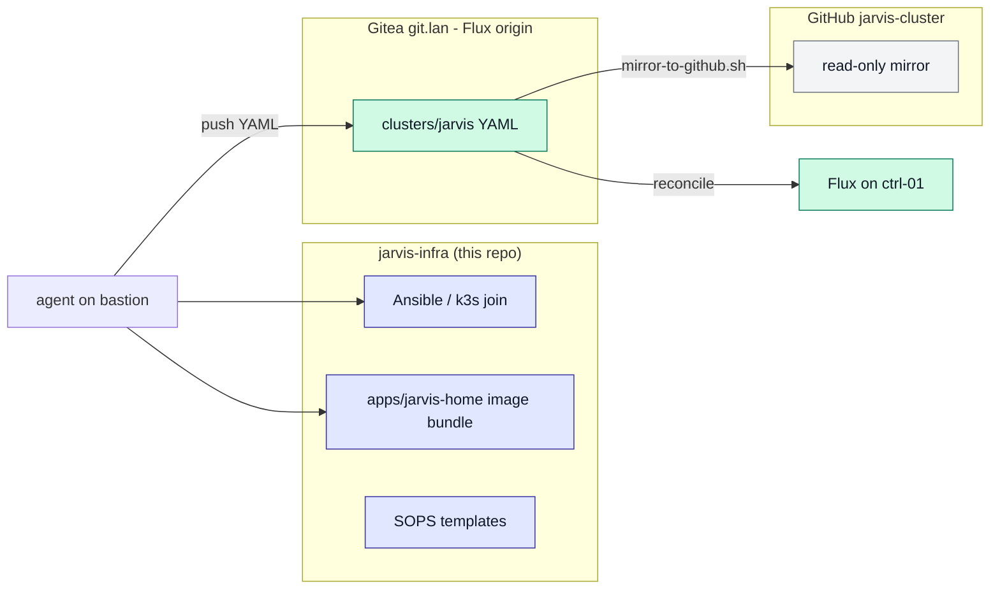
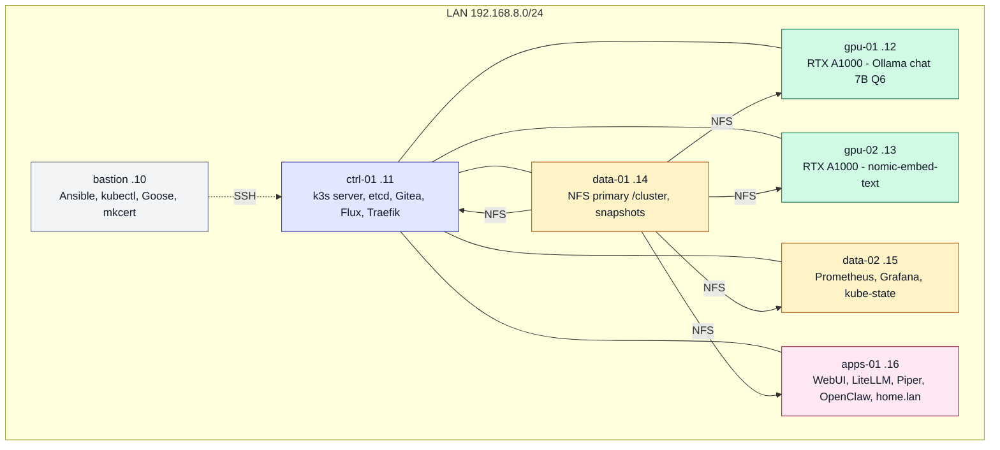
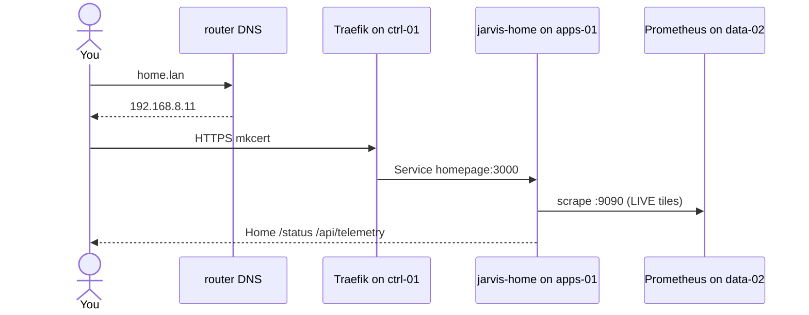

# jarvis-infra

Metal, bootstrap, and the command-center image for JARVIS.

This repo is **not** the Flux origin. Cluster YAML lives on Gitea
(http://git.lan/jarvis/cluster.git). GitHub gordoncooper/jarvis-cluster is a mirror only.

Living pins are [`VERSION`](VERSION) — GIT_TAG and IMAGE are independent.
Do not copy those numbers into scripts or docs/REBUILD.md. Alignment: scripts/check-contract.sh.

| Item | Value |
| --- | --- |
| Pins | [`VERSION`](VERSION) |
| Run as | user **agent** (HOME=/home/agent). Never bastion. |
| Rebuild | [docs/REBUILD.md](docs/REBUILD.md) |
| Lessons | [docs/LESSONS.md](docs/LESSONS.md) |
| Day to day | [docs/INTERACT.md](docs/INTERACT.md) |
| Command center | [apps/jarvis-home/](apps/jarvis-home/) |

## Why two repos

Chicken-egg: Flux needs Gitea; Gitea is a cluster app. Infra bootstraps Gitea once.

## Rack and roles

| Host | IP | Role |
| --- | --- | --- |
| bastion | 192.168.8.10 | jump |
| ctrl-01 | 192.168.8.11 | control + etcd |
| gpu-01 | 192.168.8.12 | gpu-chat |
| gpu-02 | 192.168.8.13 | gpu-embed |
| data-01 | 192.168.8.14 | storage-primary |
| data-02 | 192.168.8.15 | metrics |
| apps-01 | 192.168.8.16 | apps |

## How a browser request lands

agent.lan DNS must be 192.168.8.16 (hostPort 18789), not ctrl-01.

Full order: [docs/REBUILD.md](docs/REBUILD.md).
