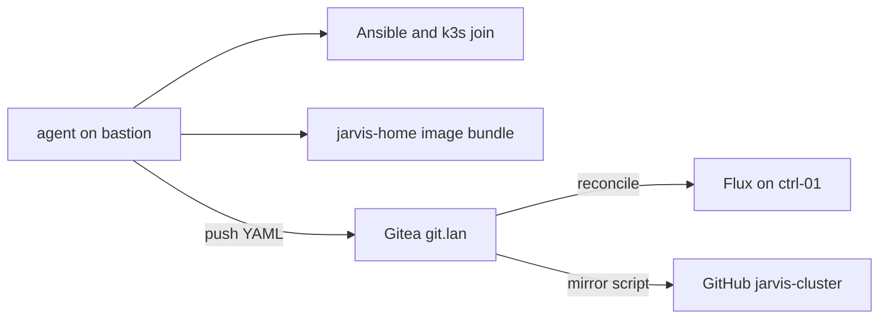
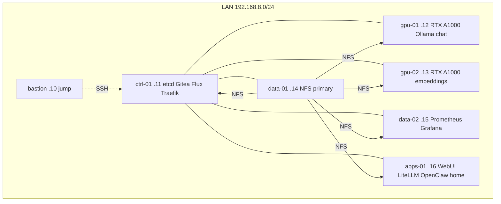

# jarvis-infra

Metal, bootstrap, and the **command-center image** for JARVIS — a six-node
k3s homelab on ThinkCentre M920x, plus a bastion.

This repo is **not** the Flux origin. Cluster YAML lives on Gitea
(`http://git.lan/jarvis/cluster.git`). GitHub
[gordoncooper/jarvis-cluster](https://github.com/gordoncooper/jarvis-cluster)
is a **mirror only**.

- Known-good git tag: **v0.4.7** (mermaid fix). Image **jarvis-home:v0.4.5**.
  Do not retag v0.4.4 / v0.4.5 / v0.4.6.
- Run as user **agent** (HOME `/home/agent`). Never `bastion`.
- Rebuild: [docs/REBUILD.md](docs/REBUILD.md)
- Do not repeat: [docs/LESSONS.md](docs/LESSONS.md)
- Day to day: [docs/INTERACT.md](docs/INTERACT.md)
- Command center: [apps/jarvis-home/](apps/jarvis-home/) (`output/` is committed)

## Why two repos

Chicken-egg: Flux needs Gitea; Gitea is a cluster app. Infra bootstraps Gitea
once, then Gitea owns YAML forever.

## Rack and roles

Six M920x (i7-8700T, 32 GiB) run k3s `v1.36.4+k3s1`. Bastion is jump only —
**not** a k3s node, no node-exporter.

- **bastion** 192.168.8.10 — jump. Ansible, kubectl, Goose. Not scheduled.
- **ctrl-01** 192.168.8.11 — control + etcd. k3s server, Gitea, Flux, Traefik.
- **gpu-01** 192.168.8.12 — gpu-chat. Ollama jarvis-local (qwen2.5 7B Q6).
- **gpu-02** 192.168.8.13 — gpu-embed. Ollama nomic-embed-text.
- **data-01** 192.168.8.14 — NFS /cluster, snapshots, backups.
- **data-02** 192.168.8.15 — Prometheus, Grafana, kube-state-metrics.
- **apps-01** 192.168.8.16 — Open WebUI, LiteLLM, Piper, OpenClaw, jarvis-home.

Homepage: imagePullPolicy Never on apps-01 only.

## Surfaces

- https://home.lan — command center. Header LIVE = Prometheus.
- https://chat.lan — Open WebUI
- http://agent.lan:18789 — OpenClaw (DNS must be .16)
- https://llm.lan/v1 — LiteLLM
- http://git.lan — Gitea (Flux origin, HTTP)
- https://grafana.lan — Grafana 14574

LAN only. mkcert TLS.

## What this repo contains

- inventory, playbooks, roles — OS, UFW, NFS, NVIDIA
- k3s/ — server (etcd on ctrl-01) and agent join
- bootstrap/gitea.yaml — first Gitea apply
- apps/jarvis-home/ — Dockerfile + committed output/
- scripts/install-jarvis-home.sh and mirror-to-github.sh
- docs/ — rebuild, restore, lessons, PHASE1-22

Image: docker.io/library/jarvis-home:v0.4.5

Full order: [docs/REBUILD.md](docs/REBUILD.md).
