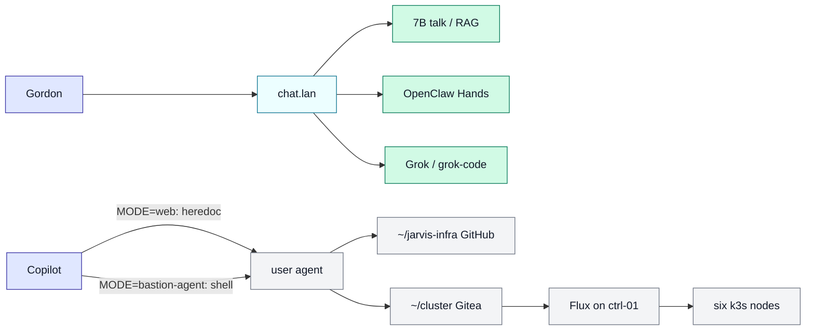
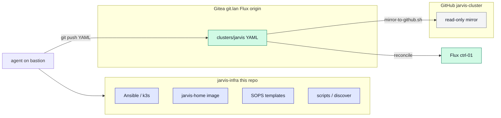
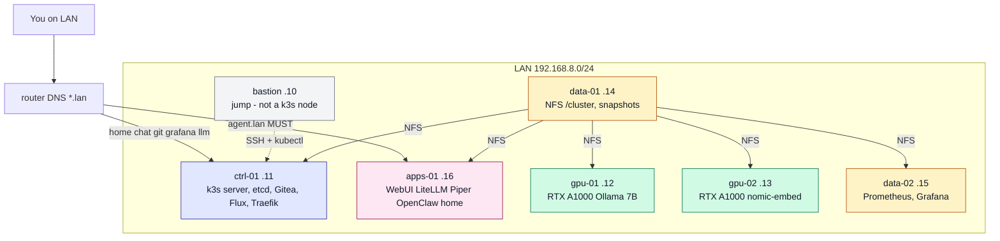
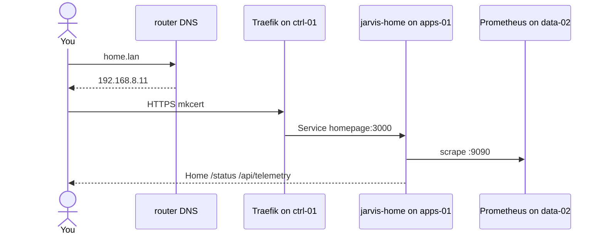
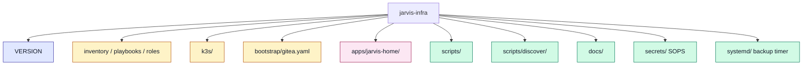
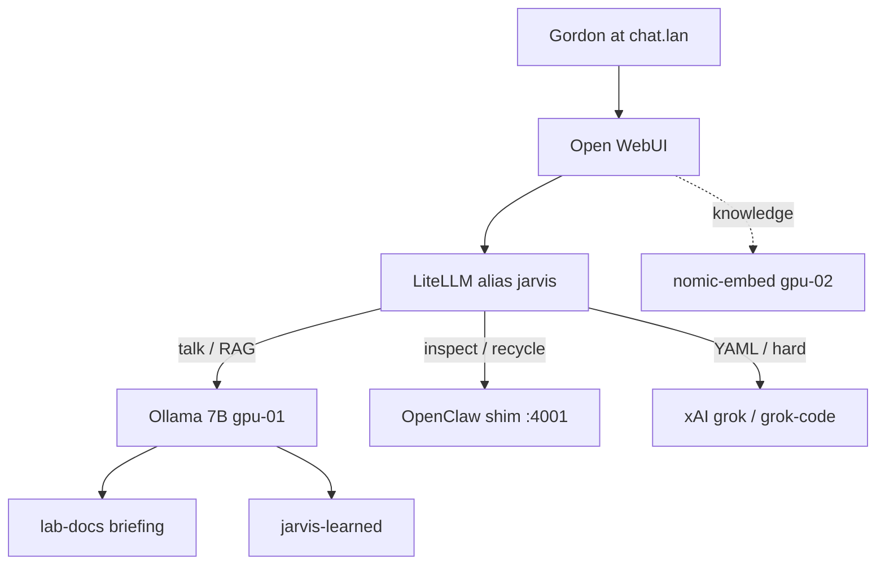
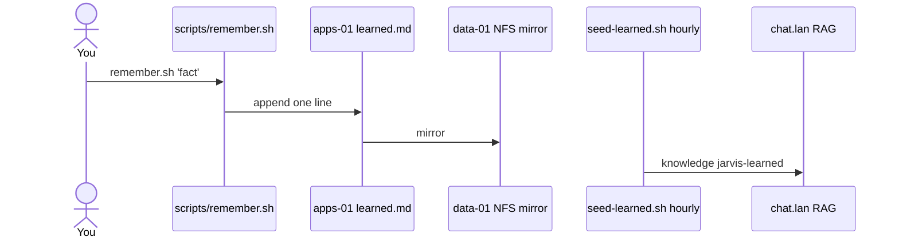
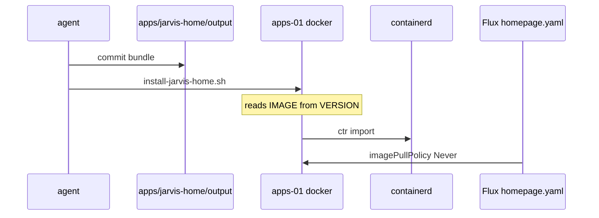
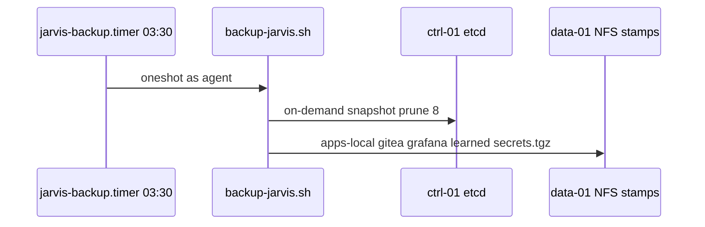

# JARVIS infra

Metal, bootstrap, secrets, scripts, and the **command-center image** for JARVIS —
a six-node k3s homelab (ThinkCentre M920x) plus a bastion jump host.

Maturity is `MATURITY` in [VERSION](VERSION). License: [MIT](LICENSE). Day 0 workshop: [docs/DEVOPS.md](docs/DEVOPS.md).

The rack **is** JARVIS. Gordon talks at [https://chat.lan](https://chat.lan).
He should not pick models or open a second console for normal use.
Local-first (electricity), Grok when the job needs a bigger brain,
Hands in-glass for live inspect.

This repo is **not** the Flux origin. Cluster YAML lives on Gitea
(`http://git.lan/jarvis/cluster.git`). GitHub
[gordoncooper/jarvis-cluster](https://github.com/gordoncooper/jarvis-cluster)
is a **mirror only**.

Living pins: **[VERSION](VERSION)** — `GIT_TAG` and `IMAGE` are independent.
Do not copy those numbers here or into `docs/REBUILD.md`. Do not retag.
Alignment: `scripts/check-contract.sh`.

| | |
| --- | --- |
| Agent contract | [AGENTS.md](AGENTS.md) — start here, always |
| What was decided | [docs/DECISIONS.md](docs/DECISIONS.md) — dated, outranks all prose |
| North star | [docs/VISION.md](docs/VISION.md) |
| Day to day | [docs/INTERACT.md](docs/INTERACT.md) |
| Operator | [docs/OPERATING.md](docs/OPERATING.md) |
| Rebuild / restore | [docs/REBUILD.md](docs/REBUILD.md) · [docs/RESTORE.md](docs/RESTORE.md) |
| Lessons | [docs/LESSONS.md](docs/LESSONS.md) |
| Backlog | [docs/BACKLOG.md](docs/BACKLOG.md) |
| Run as | user **agent** (`HOME=/home/agent`). Never `bastion`. |

Three repos: **jarvis-infra** (here — metal, scripts, docs), **cluster** (Flux
YAML, Gitea origin).

**Any AI, any surface:** read `AGENTS.md`, then `docs/DECISIONS.md`.
**CLI / Cursor:** Remote-SSH as `agent`, open this repo.
Run `scripts/copilot-whereami.sh`. If `MODE=bastion-agent`, use the shell.

## Intent

JARVIS is a lab HUD for one operator: talk, remember, see the rack, and
(when asked) act on the cluster. It is LAN-only until Tailscale. It is not
a public assistant and not an App Builder scaffold.

The product surface is **jarvis.lan** and the operator surface is **noc.lan**
(D-0002). The table below is how the house works *today*; chat.lan is being
demoted to break-glass and home.lan is retiring into noc.lan.

| Kind | Where it happens |
| --- | --- |
| Talk / RAG / remember | chat.lan → LiteLLM → 7B on gpu-01 + knowledge |
| Live inspect / recycle | chat.lan → alias `jarvis-hands` → OpenClaw |
| YAML / design | `jarvis-grok-code` (Gordon can still pick the hatch) |
| See the rack | [https://noc.lan](https://noc.lan) · home.lan is legacy · Grafana |
| Change the house | this repo (metal/image) + `~/cluster` (YAML → Gitea → Flux) |

## Who does what

| Role | May |
| --- | --- |
| Gordon | Talk at chat.lan. Override hatch (`local:` `hands:` `code:` `grok:`). Break-glass agent.lan. |
| user `agent` on bastion | kubectl, git, Ansible, Goose. The only kubeconfig. |
| user `bastion` | Nothing JARVIS. `sudo su - agent`. |
| Flux | Apply `clusters/jarvis` from Gitea. Not GitHub. |
| OpenClaw SA | Read cluster + **recycle** (pod delete / deploy patch) in listed namespaces. Not cluster-admin. |
| Homepage SA | List nodes, pods, events, Flux CRs. |
| This copilot | Discover, then one change. Web: heredoc. CLI on bastion: use the shell. |
| 7B | Talk and cite briefing / learned. No tools. |

Live cluster wins over git. GitHub can lag.

## Two repos (chicken and egg)

Flux needs Gitea; Gitea is a cluster app. Infra bootstraps Gitea **once**,
then Gitea owns YAML forever. Never point Flux at GitHub.

## Rack

Six M920x (i7-8700T, 32 GiB). k3s pin is `K3S` in `VERSION`.
Bastion is jump only — not scheduled, no node-exporter, no GPU.

| Host | IP | Role | Runs |
| --- | --- | --- | --- |
| bastion | 192.168.8.10 | jump | Ansible, kubectl, Goose. Not a node. |
| ctrl-01 | 192.168.8.11 | control + etcd | k3s server, Gitea, Flux, Traefik. Ingress VIP. |
| gpu-01 | 192.168.8.12 | gpu-chat | Ollama `jarvis` (Qwen2.5 7B Q6). |
| gpu-02 | 192.168.8.13 | gpu-embed | Ollama `nomic-embed-text`. |
| data-01 | 192.168.8.14 | storage-primary | NFS `/cluster`. etcd snapshots, backups. |
| data-02 | 192.168.8.15 | metrics | Prometheus, Grafana, kube-state-metrics. |
| apps-01 | 192.168.8.16 | apps | Open WebUI, LiteLLM, Piper, OpenClaw, jarvis-home. |

Labels: `jarvis.role=control|gpu|storage|apps`.
`agent.lan` DNS is **192.168.8.16** (hostPort 18789), never `.11`.

## Surfaces

| URL | What |
| --- | --- |
| https://home.lan | Command center — tiles, dossiers, `/status`, LIVE from Prometheus. |
| https://chat.lan | Mouth — Open WebUI, Whisper STT, Piper TTS. Default alias `jarvis`. |
| http://agent.lan:18789 | OpenClaw Control UI. **Break-glass.** HTTP on purpose. |
| https://llm.lan/v1 | LiteLLM OpenAI-shaped API. |
| http://git.lan | Gitea. HTTP on purpose (Flux origin). |
| https://grafana.lan | Grafana (NVIDIA dashboard). |

LAN only. mkcert TLS. `git.lan` and `agent.lan:18789` stay HTTP.

A browser request for home.lan:

## This clone

| Path | What |
| --- | --- |
| `VERSION` | Living git/image/k3s pins. Source this file. |
| `inventory/` `playbooks/` `roles/` | OS, UFW, NFS, NVIDIA, P300 as `/cluster`. |
| `k3s/` | Server (etcd on ctrl-01) and agent join. `INSTALL_K3S_VERSION` from VERSION. |
| `bootstrap/gitea.yaml` | First Gitea apply — before Flux exists. |
| `apps/jarvis-home/` | Dockerfile + committed `output/` SSR bundle. |
| `scripts/install-jarvis-home.sh` | docker build on apps-01, `k3s ctr import`. |
| `scripts/check-contract.sh` `verify-jarvis.sh` | Pins + live proof. |
| `scripts/backup-jarvis.sh` | Nightly NFS stamps + secrets tgz + learned. |
| `scripts/discover/` | Layered live dump. Session 0 = whereami + `90-copilot.sh`. |
| `secrets/` | `secrets.sops.yaml` in git. Age key is **not**. |
| `docs/` | COPILOT, PLAN, OPERATING, INTERACT, REBUILD, RESTORE, LESSONS. |

Sibling clone on the bastion: `~/cluster` (Gitea origin).

## Flows

### A prompt at chat.lan

Override prefixes stay as a hatch. Do not add more keyword lists.
Router detail lives in cluster YAML (LiteLLM ConfigMap).

### Remember

**Memory lives on jarvis.lan.** Say "remember that …" there; it is stored in
promoted sqlite with a confirm step, and JARVIS can list and forget it
(D-0013, D-0035). chat.lan no longer writes memory — the `jarvis_remember`
filter was removed in D-0039 because a second store on a break-glass console
is a trap: you tell one surface something and the other has never heard of it.

`learned.md` survives as **operator-written** break-glass knowledge, not as a
memory the chat writes to itself:

Not git. Not secrets. Example:

    ./scripts/remember.sh 'the lab coffee machine is on the left'

### Homepage image (Never)

Import **before** Flux. SA `homepage`. `npx srvx` is forbidden as CMD.
Do not bump `IMAGE` unless `https://home.lan/status` is wrong.

    ./scripts/install-jarvis-home.sh

### Backup and secrets

SOPS encrypts `secrets/secrets.sops.yaml` to git. The age private key lives
in `~/.config/sops/age/keys.txt` (mode 600) — not in git, not in README.
Restore: [docs/RESTORE.md](docs/RESTORE.md).

    ./scripts/backup-jarvis.sh
    ./scripts/check-contract.sh
    ./scripts/verify-jarvis.sh

## Two push paths

| What you changed | Clone on bastion | Push to |
| --- | --- | --- |
| Metal, docs, image, scripts, SOPS | `~/jarvis-infra` | **GitHub** `gordoncooper/jarvis-infra` |
| Cluster YAML (`clusters/jarvis/`) | `~/cluster` | **Gitea** `http://git.lan/jarvis/cluster.git` |

Never push cluster YAML to GitHub as origin. After Gitea, Flux reconciles.
`scripts/mirror-to-github.sh` updates the GitHub **mirror** (also the 03:30 timer).

Laptop clones are **caches**. Never copy kubeconfig off the bastion.
No `kubectl apply` — Flux only.

## Copilot

Session 0 is **whereami + `scripts/discover/90-copilot.sh`**. Then at most
one more layer from the index in [scripts/discover/README.md](scripts/discover/README.md).
Do not dump every discover script.

    ./scripts/copilot-whereami.sh
    ./scripts/discover/90-copilot.sh

## Greenfield

    ansible-playbook playbooks/ping.yml
    ansible-playbook playbooks/site.yml
    ./k3s/install-server.sh
    ./k3s/join-agents.sh
    ./scripts/install-jarvis-home.sh

Full order, TLS, models, Flux bootstrap: [docs/REBUILD.md](docs/REBUILD.md).
Greenfield does **not** run `npm run build` on the cluster.
