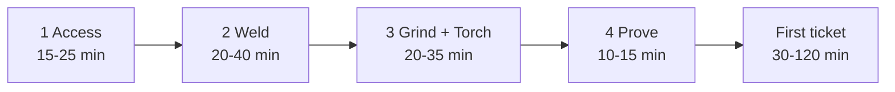
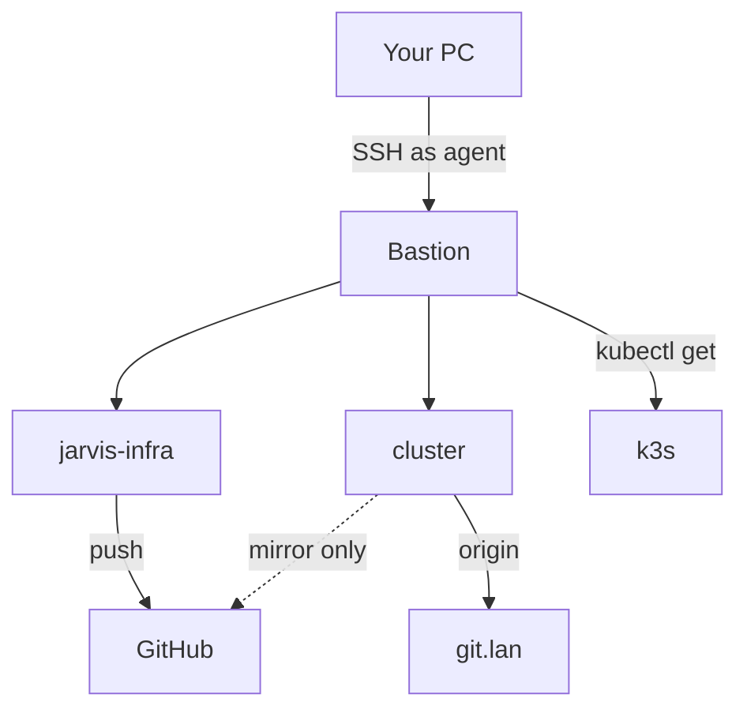
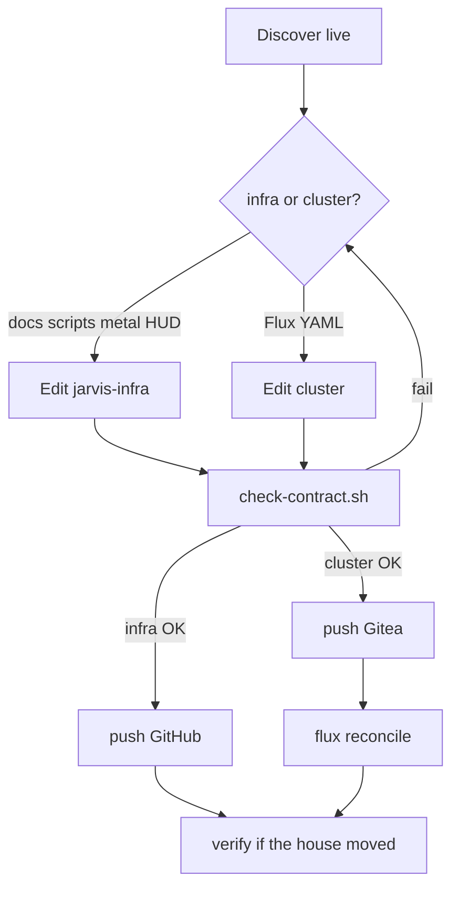
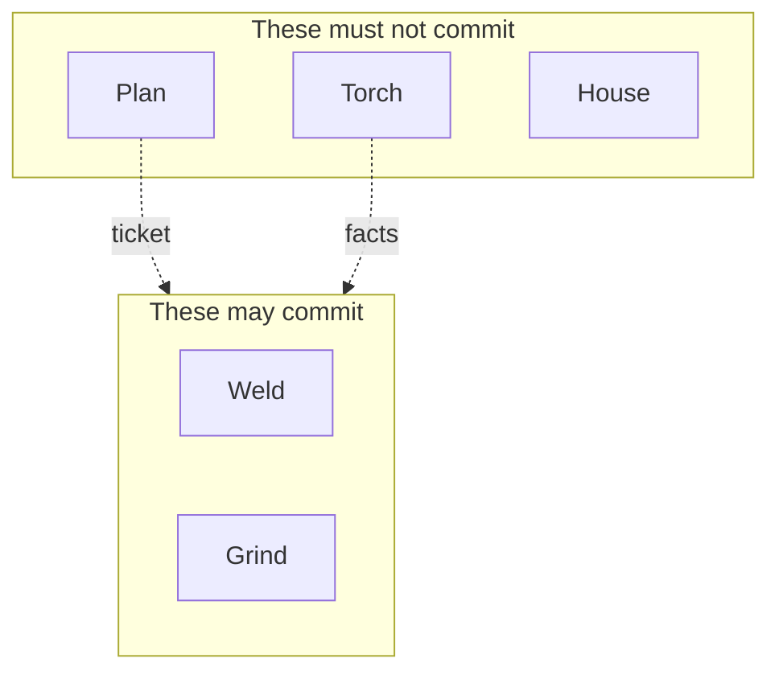
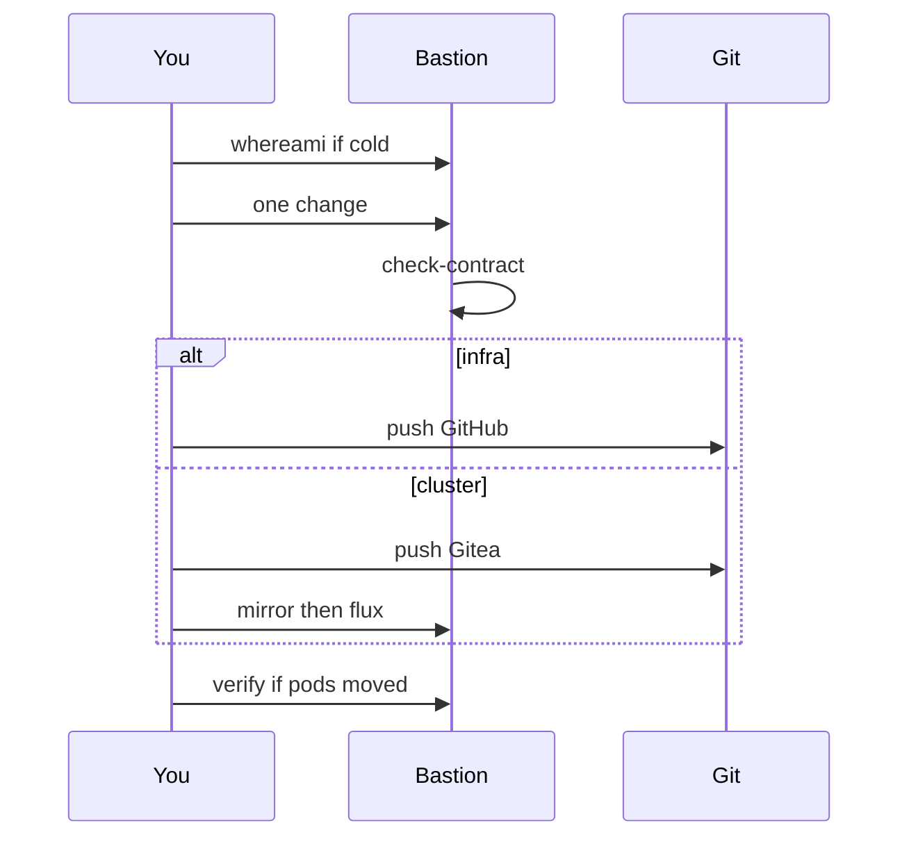

# JARVIS workshop (day 0)

You are setting up to **build** JARVIS. You are not chatting with JARVIS.

- Product (talk / Hands): https://chat.lan — not a copilot.
- Workshop (git / Flux / scripts): user **`agent` on the bastion**. Headless. No desktop on that box.
- Pins: `VERSION` (`GIT_TAG`, `IMAGE`, `K3S`, `MATURITY`). Do not copy numbers into this file.
- License: [MIT](../LICENSE).

Read this once. Then use [OPERATING.md](OPERATING.md) and [INTERACT.md](INTERACT.md) for daily ops. AIs use [COPILOT.md](COPILOT.md) and [AGENTS.md](../AGENTS.md). Product spec: [PLAN.md](PLAN.md).

---

## How long

Assume Gordon already issued an SSH key and the engineer is **on the LAN**. Times are clock time, not “years of k8s.”

| Phase | Clock | What you owe at the end |
| --- | --- | --- |
| 1. Access | **15–25 min** | `ssh` as `agent`; two clones exist; no kubeconfig on the laptop |
| 2. Weld | **20–40 min** | Remote-SSH workspace; contract OK in the bastion terminal |
| 3. Grind + Torch | **20–35 min** | `tmux` session; Aider can commit **locally**; Goose answers a read |
| 4. Prove | **10–15 min** | Checklist below; **no push** |
| **Day 0 total** | **~1.5–2 h** | Ready for a real ticket |

Add **30–45 min** if a new SSH key must be minted. Off-LAN is not day 0 (VPN comes later).

After day 0, a first *real* change: **30–60 min** for docs/scripts in `~/jarvis-infra`; **1–2 h** for Flux YAML (glance + Gitea push + reconcile + verify).

---

## 1. Picture

The bastion is a jump host. Your daily PC is the glass for the **workshop**. The six nodes are the **house**.

chat.lan is the **product**. It is not in this picture on purpose.

**Never:** copy kubeconfig to a laptop. **Never:** log in as user `bastion`. **Never:** put a GUI on the bastion.

---

## 2. What “good” looks like

One engineer, one change, one remote, then prove.

If you cannot draw that on a whiteboard, you are not ready to push.

---

## 3. Four ways to work

You will see people suggest an IDE, a terminal agent, or Goose. Use **lanes**, not three writers.

| Lane | Tool | Where | Allowed to | Day 0 time |
| --- | --- | --- | --- | --- |
| **Plan** | Grok chat (rare) | Browser / phone | Architecture. No YAML. | skip on day 0 |
| **Weld** | VS Code or Cursor **Remote-SSH** | Your PC → bastion | Flux, router, RBAC, homepage image. You glance. **You** push Gitea. | 20–40 min |
| **Grind** | **Aider** + grok-code in `tmux` | SSH / phone | One ticket → **local** commit in `~/jarvis-infra`. Stops before push. | 15–25 min |
| **Torch** | **Goose** + grok-code | tmux other pane | Read: kubectl, logs, discover. **No git commit. No git push.** | 5–10 min |
| **House** | chat.lan / OpenClaw | Product | Live JARVIS. Not a copilot. | not the workshop |

**Preference: shop floor** = Weld + Grind + Torch, with those rules. That is the rest of this guide.

Do not run Weld and Grind in the same hour. Goose never authors a commit.

---

## 4. Day 0 — Access (15–25 min)

Do this on **your daily PC**, then once on the bastion.

### 4.1 SSH as `agent` (~10 min)

On your PC, `~/.ssh/config`:

    Host jarvis-bastion
      HostName 192.168.8.10
      User agent
      IdentityFile ~/.ssh/YOUR_KEY

Prove:

    ssh jarvis-bastion 'whoami; hostname; echo HOME=$HOME'

Wanted: `agent`, host `bastion`, `HOME=/home/agent`. If you are `bastion`, stop: `sudo su - agent`.

Off-LAN is a later VPN problem. Day 0 is on the LAN.

### 4.2 Do not steal the cluster (~2 min)

- kubeconfig stays `/home/agent/.kube/config` on the bastion.
- GitHub SSH key for `jarvis-infra` already lives on the bastion (`~/.ssh/id_ed25519_github`). Push **from there**, not from a laptop clone treated as origin.
- Laptop clones of GitHub are a **cache**. See cluster [AGENTS.md](https://github.com/gordoncooper/jarvis-cluster/blob/main/AGENTS.md).

### 4.3 Two working trees (~5 min — already on the bastion)

    ~/jarvis-infra     GitHub origin      metal, scripts, docs, HUD image, SOPS
    ~/cluster          Gitea origin       Flux YAML only
                       git.lan/jarvis/cluster.git

    ssh jarvis-bastion 'git -C ~/jarvis-infra remote -v; git -C ~/cluster remote -v'

Gitea is Flux origin. GitHub `jarvis-cluster` is a mirror. After a cluster push: `~/jarvis-infra/scripts/mirror-to-github.sh`.

---

## 5. Day 0 — Weld (20–40 min)

The bastion has **no desktop**. The GUI runs on your PC. Files and kubectl stay on the bastion.

1. Install [VS Code](https://code.visualstudio.com/) (free) or Cursor on your PC. (~5–10 min)
2. Extension: **Remote - SSH**. (~2 min)
3. Connect to `jarvis-bastion`. (~2 min first time)
4. Open folder `/home/agent/jarvis-infra`. File → Add Folder to Workspace → `/home/agent/cluster`. Save the workspace. (~3 min)
5. Integrated terminal is already `agent@bastion`. Run (~3 min):

       . ~/jarvis-infra/VERSION && echo $GIT_TAG $IMAGE $MATURITY
       ~/jarvis-infra/scripts/copilot-whereami.sh
       ~/jarvis-infra/scripts/check-contract.sh

   Wanted: `MODE=bastion-agent`, `HANDS=yes`, `CONTRACT OK`.

6. Agent in the editor (pick one, BYOK, same xAI key the house already uses) (~10–20 min first time):

   - **Cline** in VS Code, or Cursor’s agent.
   - Model: the grok-code id Goose uses (`examples/goose/config.yaml` — no secrets in git).
   - API key: on the bastion, `~/.xai-api.key` (mode 600). Point the IDE at that **remote** env; do not paste the key into a laptop file if you can avoid it.
   - System / rules: [AGENTS.md](../AGENTS.md) and [COPILOT.md](COPILOT.md).

Weld is for anything Flux will apply: `~/cluster/clusters/jarvis/**`, homepage image, OpenClaw RBAC, LiteLLM.

---

## 6. Day 0 — Grind + Torch (20–35 min)

Still no GUI. SSH is enough (phone included).

    ssh -t jarvis-bastion tmux new -A -s jarvis

Suggested panes (~5 min to split once):

| Pane | Cwd | Command | Writes git? |
| --- | --- | --- | --- |
| 0 Grind | `~/jarvis-infra` | Aider | local commits only |
| 1 Torch | `~/jarvis-infra` | Goose | no |
| 2 Logs | `~` | only when something is on fire | no |

### 6.1 Aider — Grind (15–25 min)

    sudo apt-get install -y pipx
    pipx install aider-chat
    pipx ensurepath

Key and model: same as Goose. OpenAI-compatible:

    export OPENAI_API_BASE=https://api.x.ai/v1
    export OPENAI_API_KEY="$(cat ~/.xai-api.key)"

    cd ~/jarvis-infra
    aider --model openai/grok-code-fast-1

If the model id in Goose config differs, use **that** id. Do not print the key.

Rules for Aider:

- One ticket, one commit.
- Default tree: `~/jarvis-infra` only.
- Do **not** `--yes` against `~/cluster` until Weld has been boring for a while.
- After Aider commits: `scripts/check-contract.sh`. Then **you** `git push`.
- Never `git tag -f`. Never point Flux at GitHub.

Ticket shape (paste into Aider, then delete it):

    Change: <one sentence>
    Files: <paths>
    Do not: cluster YAML | retag | kubectl apply | widen RBAC
    Done when: check-contract.sh prints CONTRACT OK

### 6.2 Goose — Torch (5–10 min)

Already on this bastion (`scripts/configure-goose.sh`). Use grok-code. **Never** `jarvis-local` — it invents hardware.

Prove with a **read** (`kubectl get nodes` via Goose). If it offers `git commit`, `git push`, or `kubectl apply`, refuse.

---

## 7. The cycle (every change)

Walk this once on day 0 **without pushing** (~10 min). Real changes after that: 30–60 min infra, 1–2 h cluster YAML.

Session 0 for an AI (or a human who just sat down): [COPILOT.md](COPILOT.md) — whereami + `90-copilot.sh`, **one** extra discover if needed, then stop and change one thing.

Homepage image: import on `apps-01` **before** Flux (`imagePullPolicy: Never`). See [apps/jarvis-home/README.md](../apps/jarvis-home/README.md).

---

## 8. Two remotes (print this)

| Change | Clone | `git push` |
| --- | --- | --- |
| Metal, docs, scripts, HUD, SOPS | `~/jarvis-infra` | GitHub `jarvis-infra` |
| Cluster YAML | `~/cluster` | **Gitea** `http://git.lan/jarvis/cluster.git` |

Then mirror. Never `kubectl apply -f`. Never `git push` cluster YAML to GitHub as if it were origin.

---

## 9. Prove day 0 (10–15 min)

On the bastion as `agent`:

- [ ] `whoami` → `agent`
- [ ] `scripts/copilot-whereami.sh` → `MODE=bastion-agent`
- [ ] `scripts/check-contract.sh` → `CONTRACT OK`
- [ ] `git -C ~/cluster remote get-url origin` contains `git.lan`
- [ ] Remote-SSH terminal is the same user (Weld)
- [ ] `tmux` session `jarvis` exists (Grind/Torch)
- [ ] Goose answers a **read** question without committing
- [ ] You have **not** copied kubeconfig off the box

You are done with day 0. The next change is a real ticket, not more tooling.

---

## 10. Don't

- Desktop / GNOME / code-server on the bastion (another app to back up).
- Three writers at once (Cline + Aider + Goose committing).
- Overnight `--yes` on `~/cluster`.
- `npx srvx` as the homepage CMD. App Builder. Port 8080 Vite preview.
- Retag. Mix unrelated diffs. Widen OpenClaw RBAC unless Gordon named the verbs.
- Teach chat.lan to be the workshop.

Live cluster wins. Git is the undo for Grind. Flux is not an undo. If you are unsure, discover first (`scripts/discover/`), then ask — do not invent the rack.
